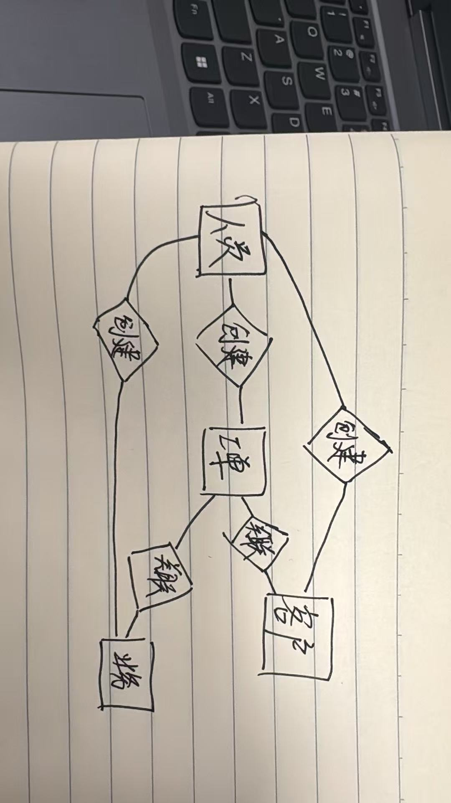
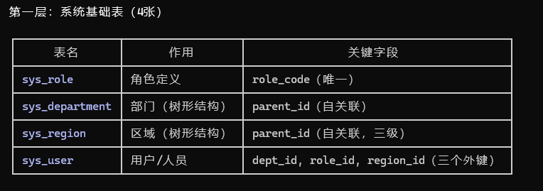

日志6.9

休息了几天回来，我在大模型的帮助下，发现开始创建的四张表存在许多问题这四张表只能跑通最基本的增删改查，题目要求的"区域内查询""工单流转追溯""数据可恢复"全部无法实现。重新整理了一下思路决定跟着claude重新做。

四个模块
客户管理 → 需要一张存客户信息的表

业务管理 → 需要一张存业务信息的表

工单管理 → 需要一张存工单的表，而且"工单需将客户与业务进行关联"

人员管理 → 需要一张存人员信息的表
做出E-R图

一个工单必须同时关联一个客户和一个业务，形成三角关系。

用sql语句创建了9个表分别为系统基础表（4张），业务核心表（4张），辅助表（1张）并且将初始化数据导入了进去

系统基础表

业务核心表

辅助表

后端开发
基本思路就是每张表配一个Controller、一个Service、一个Mapper。客户、业务、工单、人员四个模块都是增删改查
工单这块稍微复杂一点，因为不是简单的增删改查就完了，它有个状态流转：创建出来是待处理，指派给某个人变成处理中，处理完回单变已回单，审核通过关闭。中间还能退单。每次状态变了都得往日志表里记一条，方便以后查。

遇到的问题
一开始在IDEA里跑项目就报错，查了半天发现是Lombok不兼容，我装的JDK版本太新了，换成JDK 17才跑起来。