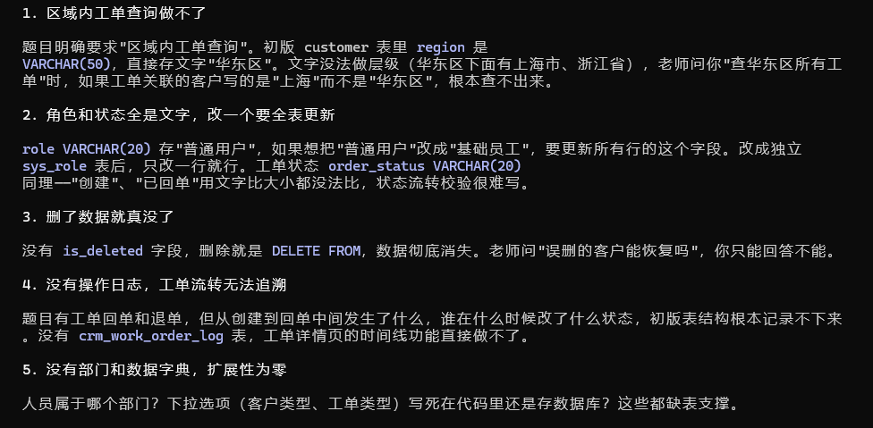
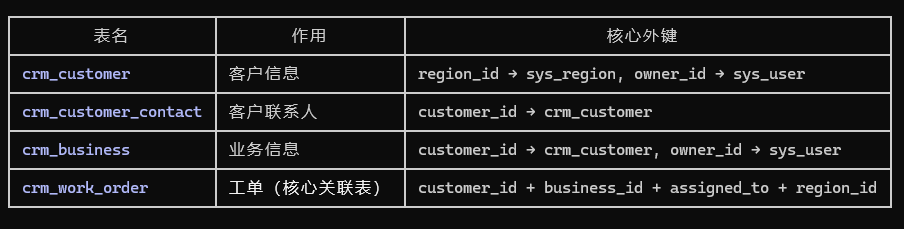
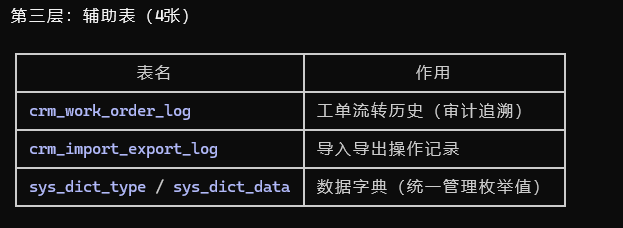

日志6.9

休息了几天回来，我在大模型的帮助下，发现开始创建的四张表存在许多问题这四张表只能跑通最基本的增删改查，题目要求的"区域内查询""工单流转追溯""数据可恢复"全部无法实现。重新整理了一下思路决定跟着claude重新做。

四个模块
客户管理 → 需要一张存客户信息的表
业务管理 → 需要一张存业务信息的表
工单管理 → 需要一张存工单的表，而且"工单需将客户与业务进行关联"
人员管理 → 需要一张存人员信息的表
做出E-R图

一个工单必须同时关联一个客户和一个业务，形成三角关系。

用sql语句创建了12个表分别为系统基础表（4张），业务核心表（4张），辅助表（4张）
系统基础表

业务核心表

辅助表
